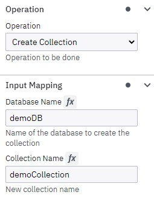
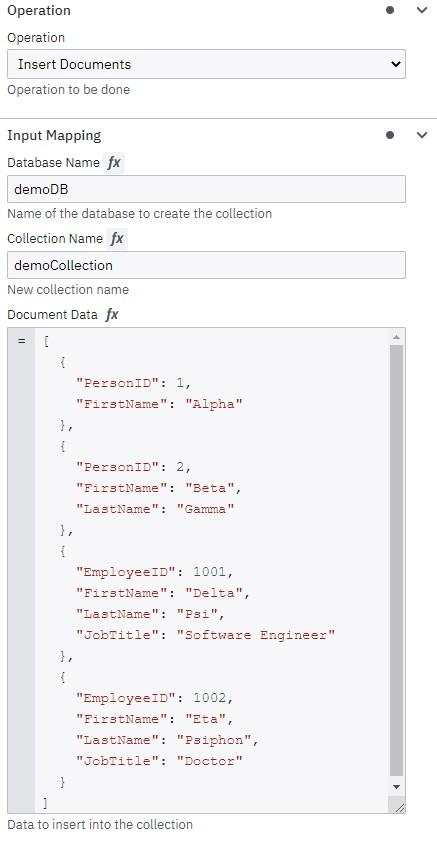
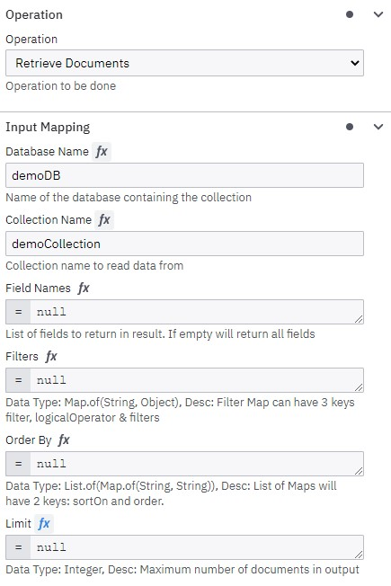
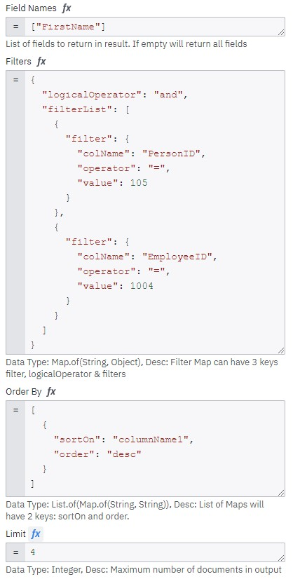
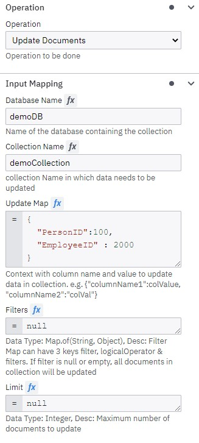
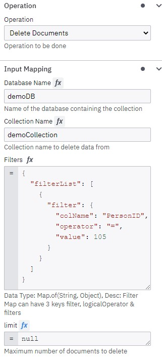
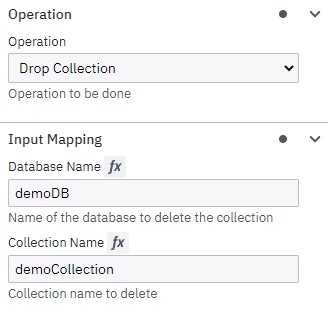
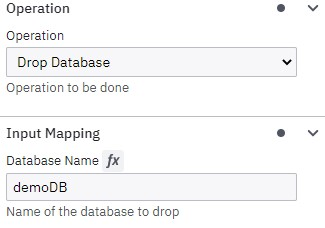

# Acheron MongoDB Database Operations Connector
A custom Camunda outbound connector to perform database operations in MongoDB database.

## Supported Operations
|Operation           |                Description           |
|--------------------|--------------------------------------|
|Create a Collection | This operation creates a new collection in the specified database.|
|Insert Documents | This operation is to insert documents in the specified collection of the specified database. |
|Retrieve Documents | This operation is to retrieve documents from the collection that is in the database specified. It also supports features like Filters, Sort, Projection and Filters.|
|Update Documents  | This operation is used to update the fields of the documents present in a collection. It also supports  Filters and Limit features.|
|Delete Documents | This operation is used to delete the documents that are present in a collection. It also supports Filters and Limit features.|
|Delete Collection |This operation is used to delete the collection that is present in a database.|
|Delete Database |This operation is used to delete the entire database. |

## Configuration
### Environment Setup
A MongoDB environment is required with valid credentials. The credentials and the server details should be given as environment variables.
```
MONGODB_USERNAME = use...
MONGODB_PASSWORD = pas...
MONGODB_HOST = localhost
MONGODB_PORT = 27017 (whichever host and port where mongoDB is running)
```
### Configure Runtime
<li> Generate the jar file

```
mvn clean package
```

<li>Build a docker image

```
docker build -t mongodb-connector .
```
&emsp;Dockerfile :
```
FROM camunda/connectors:0.21.3
COPY target/mongodb-connector-0.0.1-SNAPSHOT-jar-with-dependencies.jar /opt/app/
ENTRYPOINT ["/start.sh"]
```
<li>Build a docker runtime

  &emsp;&emsp;&emsp;Configure your runtime as per your installation from <a href="https://docs.camunda.io/docs/self-managed/connectors-deployment/connectors-configuration/">here</a> and start a container of the built docker image.

### Element Template

&emsp;&emsp;&emsp;The connector element template that should be used for this connector can be found as a JSON file in the "element-templates" folder.

## API
### Create Collection
This operation creates a new collection in the specified database, if the specified database is not present, then a new database is created, in which the collection is created.<br/>


### Insert Documents
This operation is to insert documents in the specified collection of the specified database. Even if a database or a collection is not present, a new database with the given name is created, in which a new collection with the given name is created, into which the documents are inserted.<br/>


### Retrieve Documents
This operation is to retrieve documents from the collection that is in the database specified.<br/>
<ul>
<li>Simple Retrieve - If any of the Filters, OrderBy, Sort, FieldNames are null, then that particular function is omitted.</li>
</ul>

<ul>
<li>Retrieve with Filters, Limits and Sort</li>
</ul>
<br/>
Filters Sample JSON:

```json
{
  "logicalOperator": "and", //This can be and, or, not. If this field is not given, then the default is **AND**. Case Insensitive
  "filterList": [
    {
      "filter": {
        "colName": "PersonID",
        "operator": "=",     //Valid operators, if invalid, the default one is "="
        "value": 105
      }
    },
    {
      "filter": {
        "colName": "EmployeeID",
        "operator": ">=",
        "value": 1004
      }
    }
  ]
}
```
OrderBy SampleJSON

```json
[
  {
    "sortOn": "EmployeeID",
    "order": "desc" //Can be asc or desc. Case Insensitive.
  }
]
```

### Update Documents
This operation is used to update the fields of the documents present in a collection. If no filters or limit is given, then all documents present in the database. If filters are given, then only the documents matching those filters are updated. If any limit is given, then that many count of documents is only updated. All combinations between Filters and Limit are valid.<br/><br/>
<br/>
Update Map Sample:

```json
{
    "PersonID":1000 //"fieldName":"to be updated value"
}
```
### Delete Documents
This operation is used to delete the documents that are present in a collection. If no filters and limit is given, then all the documents will be deleted. If they are given, then the matching documents only is deleted.<br/>


### Drop Collection
This operation is used to delete the collection that is present in a database. If there is only one collection present in the database that is to be deleted, then subsequently the database is also deleted.<br/>


### Drop Database
This operation is used to delete the entire database.<br/>


## Sample BPMN
The sample BPMN for all these operations are available in the "bpmn" folder.

[Blog](https://blog.acheron-tech.com/camunda-mongodb-connector/) <br/>
[Videos](https://www.youtube.com/playlist?list=PLKYpjK0JISJYJciJdrqPZVQtVqItBje14)

## Contact Information
For any queries and further support, please drop us a mail at camunda.support@acheron-tech.com
